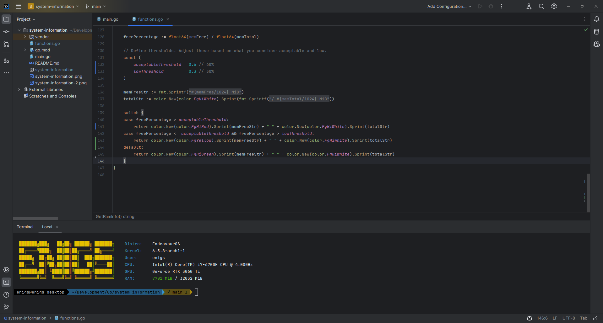

# Linux System Info

Parses machine information based on my use case. Embeded this over at my terminal to initialize the script everytime a new terminal is initialized.

### Terminal View

### IDE View
